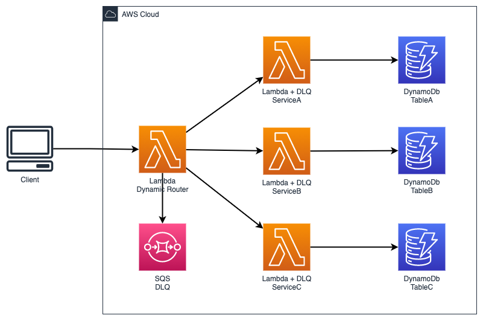
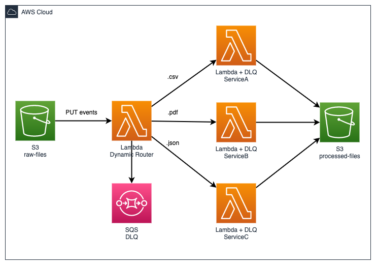

# The Router Pattern

Use-case: **Asynchronous** decision making

Benefits:

- Extremely cost efficient and simple to implement
- Decoupling

Considerations:

- Limited error handling because of the asynchrounous behavior and parallelism
- For complex decision making with error handling and parallelism, use **Amazon state machines**

The Router pattern allows you to connect the client request (or events) to one of multiple output strategies. Basically, a glorified `switch` statement.

## Architecture

<p align="center">
  
</p>

In the architecture, there is a one Lambda function listening for request. Once the request is received, the lambda function will simply determine which task type should be used to process the request.

The requests types are asynchronous, that is why each lambda function has its own dead-letter-queue to forward the request when there is a failure -- this is to allow the developers to check the messages for investigation.

In this example, the lambda function is simply interacting with the DynamoDb, a complex business logic will also be possible.

Another example, the diagram below is similar with the original architecture. However, the lambda router function is triggered by an S3 PUT event.

<p align="center">
  
</p>

If a file is dropped into the S3 bucket, the lambda router will simply identify the extension of the file (if it is `.csv`, `.json`, or `.pdf`) and decide on which service to forward the request. The challenge here is each file could have a different logic on processing the data.

By using the Router pattern approach, we can decouple each unique logics on each Lambda and focus on building the logic separately (separation of concerns).

## Deployment

Run the following command.

```sh
$ serverless deploy --aws-profile {PROFILE} -r {AWS_REGION}
```

## Cleanup

```sh
$ serverless remove --aws-profile {PROFILE} -r {AWS_REGION} -v
```
