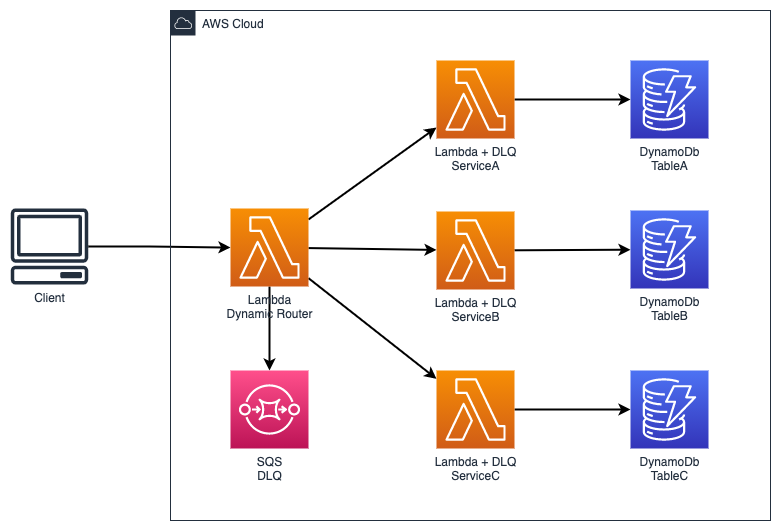

# The Router Pattern

Use-case: **Asynchronous** decision making

Benefits:

- Extremely cost efficient and simple to implement
- Decoupling

Considerations:

- Limited error handling because of the asynchrounous behavior and parallelism
- For complex decision making with error handling and parallelism, use **Amazon state machines**

## Architecture

<p align="center">
  
</p>

## Deployment

Run the following command.

```sh
$ serverless deploy --aws-profile {PROFILE} -r {AWS_REGION}
```

## Cleanup

```sh
$ serverless remove --aws-profile {PROFILE} -r {AWS_REGION} -v
```
