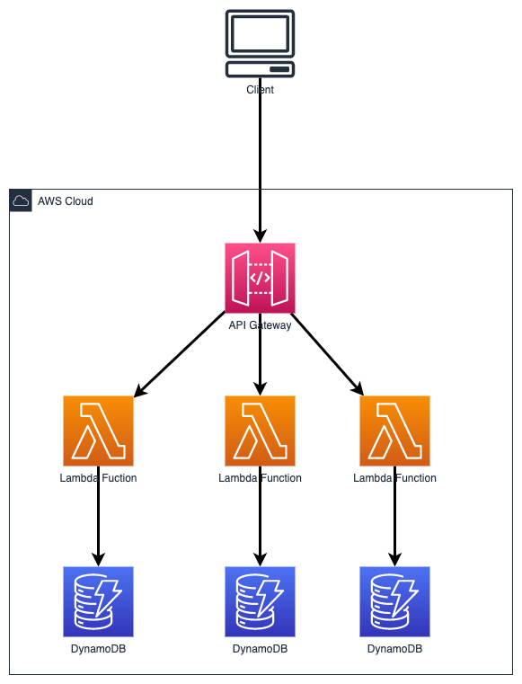

# Simple Web Service Pattern

The most simple pattern in AWS. It allows you to build a full serverless API. In the diagram, each API has its own Lambda handler and its own datastore (DynamoDB), it is a best practice that each Lambda has highly restrictive set of IAM permission in terms of what it can access to AWS.
Depending on the business use-case, users can also choose to use only one datastore for simplicity.

## Architecture

  

- API Gateway - expose REST APIs
- Lambda function - the business logic is stored here
- DynamoDB - for datastore

## Stack

- AWS SDK for JavaScript v3
  - Compared to version 2, version 3 allow us to install what we need (by module and not the whole AWS SDK)
- Github pipeline for CI/CD

## Running

The whole infrastructure is written using Serverless Framework. This is to allow seamless development in local and deployment to AWS environment.
