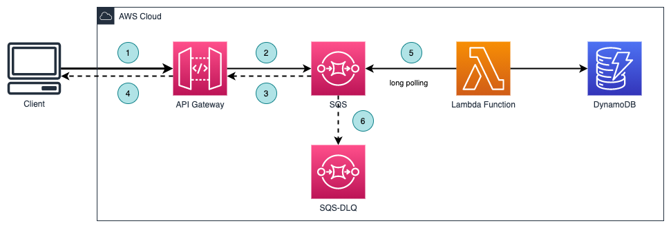

# Storage First Pattern

This pattern saves the data permanently before the business logic is applied. The advantage of this pattern is that it improves the resilience of the application. By persisting the data before processing, you can continue to use the original data in the event of an error.

The developers can configure a dead-letter-queue in the receiving SQS for seamless error handling. By directly integrating API Gateway to SQS, developers can increase application reliability while reducing lines of code.

This pattern allows for a high volume of incoming traffic even if the backend services are not scalable.

## Architecture

  

- API Gateway - expose REST APIs
- SQS - receive the request and just return acknowledgedment that the request is submitted.
- Lambda function - the business logic is stored here
